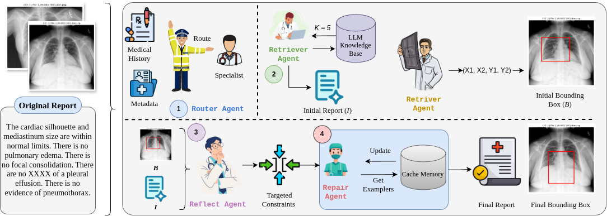

# Route, Retrieve, Reflect, Repair: Self-Improving Agentic Framework for Visual Detection and Linguistic Reasoning in Medical Imaging

_Abstract: Medical image analysis increasingly relies on large vision-language models (VLMs), yet most systems remain single-pass black boxes that offer limited control over reasoning, safety, and spatial grounding. We propose R^4, an agentic framework that decomposes medical imaging workflows into four coordinated agents: a Router that configures task- and specialization-aware prompts from the image, patient history, and metadata; a Retriever that uses exemplar memory and pass@k sampling to jointly generate free-text reports and bounding boxes; a Reflector that critiques each draft-box pair for key clinical error modes (negation, laterality, unsupported claims, contradictions, missing findings, and localization errors); and a Repairer that iteratively revises both narrative and spatial outputs under targeted constraints while curating high-quality exemplars for future cases. Instantiated on chest X-ray analysis with multiple modern VLM backbones and evaluated on report generation and weakly supervised detection, R^4 consistently boosts LLM-as-a-Judge scores by roughly +1.7-+2.5 points and mAP50 by +2.5-+3.5 absolute points over strong single-VLM baselines, without any gradient-based fine-tuning. These results show that agentic routing, reflection, and repair can turn strong but brittle VLMs into more reliable and better grounded tools for clinical image interpretation._

<!-- [Excel Sheet](https://docs.google.com/spreadsheets/d/16qSgFC3SLRuvO_ToPABohZfjtFl4FzW53Hsn8WYMHII/edit?gid=0#gid=0)

[Doc File](https://docs.google.com/document/d/1aO5CXOMbZyN9ppbhzPo4NWxCCJpVZasSG6NG8FLTIq0/edit?tab=t.0)

[Draw.io](https://app.diagrams.net/?src=about#G1zmAnptaM-gC-YsyG25t2WfgOwH5rtBh-#%7B%22pageId%22%3A%227Aau3VX_KsaEKX_yKslY%22%7D)

[Presentation](https://docs.google.com/presentation/d/1Onni2UWFNT647k07EYVdMs-RgyEtEHMMl_Tkp2eF91o/edit?slide=id.p#slide=id.p) -->
